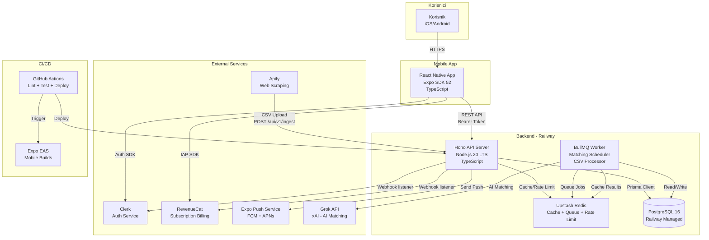
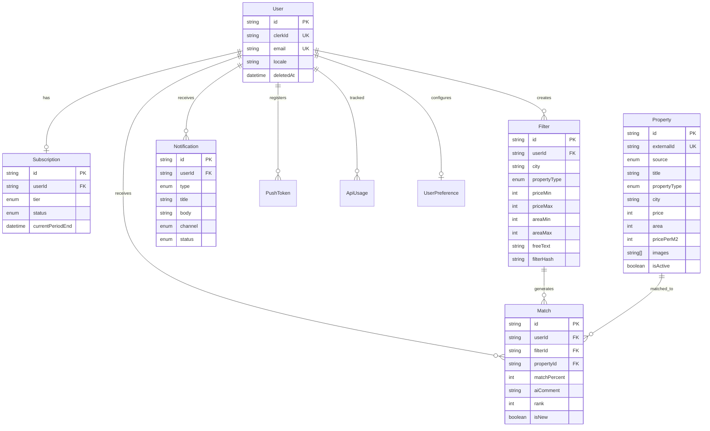

# CTO Tehnicka Arhitektura — AI StanFinder
**Datum**: 01.04.2026
**Agent**: CTO
**Status**: Faza 3 — Tehnicka arhitektura
**Dependency**: CPO product definicija (F2), UX wireframes (F2), CFO budget (F1)

---

## 1. Tech Stack odluke

### 1.1 Mobile Framework: React Native (Expo SDK 52+)

**Izbor**: React Native s Expo managed workflow.

**Obrazlozenje**: Jedna codebase za iOS i Android smanjuje development effort za ~40%. Expo managed workflow eliminira potrebu za nativnim build konfiguracijama u MVP fazi. Tim vec ima TypeScript iskustvo, a React Native ekosustav je najzreliji cross-platform framework s 10+ godina u produkciji.

**Alternativa**: Flutter. **Zasto NE**: Manji talent pool na HR trzistu, Dart nije dio naseg stack-a, a interop s JS/TS ekosustavom (shared types, npm paketi) zahtijeva dodatni bridge. Za mobilnu app koja je primarno lista + forme + push notifikacije, RN s Expo je dovoljan i provjereniji izbor.

**ADR**: Nije potreban — niska cijena promjene u MVP fazi (max 2 tjedna za migraciju na bare workflow ako Expo limitira).

---

### 1.2 Backend Runtime: Node.js 20 LTS

**Izbor**: Node.js 20 LTS.

**Obrazlozenje**: LTS garancija do travnja 2026+. Dijeli TypeScript s frontendom sto omogucava shared types u /src/shared/. Event-loop model je dobar za I/O-heavy workload (API proxy, DB upiti, external API pozivi). Nema CPU-heavy procesiranja — AI dio delegiramo Grok API-ju.

**Alternativa**: Go, Bun. **Zasto NE**: Go je performantniji, ali za 15.000 korisnika Node.js je vise nego dovoljan, a tim ne treba uciti novi jezik. Bun je premlad za produkciju (1.x, manjkav ekosustav, nedovoljno battle-tested).

---

### 1.3 HTTP Framework: Hono

**Izbor**: Hono v4.

**Obrazlozenje**: Lagan (14KB), brz (blizu raw HTTP performansi), TypeScript-first s inferiranim tipovima za rute. Middleware ekosustav pokriva auth, CORS, rate limiting, validation (Zod). Radi na Node.js, Bun, Cloudflare Workers — olaksava potencijalnu migraciju. Hono je "boring enough" — stabilan, dobro dokumentiran, aktivno odravan.

**Alternativa**: Express. **Zasto NE**: Express 4.x nema nativni TypeScript support, middleware je callback-based, a performanse su 2-3x losije. Express 5.x je u beta vec godinama. Fastify je solidan ali tezi za TypeScript type inference.

---

### 1.4 Baza podataka: PostgreSQL 16 (Railway Managed)

**Izbor**: PostgreSQL 16 na Railway managed.

**Obrazlozenje**: PostgreSQL je industrijski standard za relacijske podatke. Podrzava JSONB za fleksibilne filter definicije, full-text search za osnovnu pretragu (pg_trgm), i materialized views za denormalizaciju match rezultata. Railway managed DB eliminira operativni overhead (backup, patching, monitoring ukljucen).

**Alternativa**: Supabase PostgreSQL. **Zasto NE**: Supabase dodaje Auth/Realtime/Storage layer koji ne koristimo (koristimo Clerk za auth). Placanmo za feature-e koje ne trebamo. Railway daje cisti PostgreSQL po nizoj cijeni za nase potrebe (do 10GB, ~$7/mj).

**CFO uskladenost**: Railway PostgreSQL starter je ~$7/mj, skalira do $20/mj za 10k korisnika. Unutar budzeta od €25/mj (base scenarij).

---

### 1.5 ORM: Prisma 6

**Izbor**: Prisma 6.

**Obrazlozenje**: Type-safe query builder generira TypeScript tipove direktno iz sheme. Migracije su deklarativne i verzioniraju se s kodom. Prisma Client ima izvrstan DX za CRUD operacije koje cine 80% nasih upita. Prisma Studio omogucava vizualni pregled podataka u developmentu.

**Alternativa**: Drizzle ORM. **Zasto NE**: Drizzle je blize SQL-u sto je prednost za kompleksne upite, ali nase upite su pretezno CRUD. Prisma ima bolju dokumentaciju, veci community, i provjereniji migration workflow. Za JOIN-heavy upite koristimo Prisma raw SQL.

---

### 1.6 Autentifikacija: Clerk

**Izbor**: Clerk.

**Obrazlozenje**: Hosted auth servis s React Native SDK-om. Pokriva email/password registraciju, session management, webhook-ove za user lifecycle evente. Eliminira potrebu za izgradnjom auth sustava od nule (JWT rotation, password hashing, email verifikacija, rate limiting na login). Free tier pokriva 10.000 MAU — dovoljno za prvih 12 mjeseci.

**Alternativa**: NextAuth / Lucia Auth. **Zasto NE**: NextAuth je vezan uz Next.js (mi koristimo Hono + RN). Lucia je self-hosted sto znaci da moramo sami rjesavati security patching, session storage, i OWASP compliance. Za startup koji treba brz time-to-market, hosted auth je ispravna odluka.

**ADR**: Clerk vendor lock-in je prihvatljiv rizik jer je auth API surface relativno mala (register, login, logout, session check). Migracija na self-hosted zahtijeva ~1 tjedan.

---

### 1.7 Push notifikacije: Expo Notifications + Firebase Cloud Messaging

**Izbor**: Expo Push API koji koristi FCM (Android) i APNs (iOS) pod haubom.

**Obrazlozenje**: Expo Push API pruza unified interface za oba platforma. Besplatan do 1M notifikacija/mjesecno (CFO zahtjev). SDK je vec integriran u Expo managed workflow. Server-side saljem push token na Expo Push Server koji dispatcha na FCM/APNs.

**Alternativa**: OneSignal. **Zasto NE**: Dodaje dependency na treci servis kad Expo vec ima integrirano rjesenje. OneSignal free tier ima limit od 10k subscribera sto cemo dostici u M9-M10.

---

### 1.8 In-App Purchases: RevenueCat

**Izbor**: RevenueCat.

**Obrazlozenje**: Abstrahira Apple App Store i Google Play billing API-je. Pruza server-side webhook za subscription lifecycle (new, renewed, cancelled, expired). Omogucava A/B testiranje cijena. Dashboard za MRR, churn, LTV metriku — direktno koristeno za CFO KPI-je. Free tier do $2.5k MTR.

**Alternativa**: Direktna integracija s StoreKit 2 / Google Play Billing. **Zasto NE**: Svaki store ima razlicit API, razlicite edge case-ove (grace period, billing retry, family sharing). RevenueCat rjesava sve ovo s jednim SDK-om. Development ustedamo minimalno 2 tjedna.

---

### 1.9 Deployment: Docker + Railway

**Izbor**: Railway za backend, Expo EAS za mobile builds.

**Obrazlozenje**: Railway pruza Dockerfile deployment s autoscaling, managed PostgreSQL, environment variables, i deploy preview-e. Cijena skalira s upotrebom (pay-per-use), sto odgovara CFO zahtjevu za nizak trosak u ranoj fazi (~$5-20/mj za backend). Expo EAS Build/Submit za iOS/Android builds i App Store submission.

**Alternativa**: Fly.io, Render. **Zasto NE**: Railway ima bolji DX za monolith deployment (git push = deploy). Fly.io zahtijeva vise konfiguracije (fly.toml, Machines API). Render je sporiji na cold start.

---

### 1.10 CI/CD: GitHub Actions

**Izbor**: GitHub Actions.

**Obrazlozenje**: Integriran s GitHub repozitorijem. Besplatan za public repo, 2000 min/mj za private. Pokriva lint, test, build, deploy pipeline. Expo EAS ima GitHub Actions integration za mobile builds.

---

### 1.11 Testiranje: Vitest (unit) + Detox (E2E mobile)

**Izbor**: Vitest za backend unit/integration testove, Detox za mobile E2E.

**Obrazlozenje**: Vitest je brz (Vite-based), kompatibilan s Jest API-jem, nativni TypeScript/ESM support. Detox je najprovjereniji E2E framework za React Native (Wix ga koristi na 100M+ korisnika). Playwright ne podrzava React Native — stoga Detox.

---

### 1.12 Caching: Redis (Upstash)

**Izbor**: Upstash Redis (serverless).

**Obrazlozenje**: Serverless Redis s pay-per-request modelom. Koristimo za: (1) Grok API response cache (TTL 15min), (2) rate limiting (sliding window), (3) deduplication lock za CSV ingest. Upstash free tier: 10.000 req/dan, Pro: $10/mj za 200k req/dan — dovoljno za 15k korisnika.

**Alternativa**: Self-hosted Redis na Railway. **Zasto NE**: Railway Redis addon je $10/mj s fiksnim memorijskim limitom. Upstash je serverless, nema maintenance, i skalira automatski.

---

### 1.13 Job Scheduling: BullMQ

**Izbor**: BullMQ s Redis backendom (Upstash).

**Obrazlozenje**: BullMQ je najzreliji job queue za Node.js. Podrzava: cron schedule (za FREE tier 2x/dan), repeatable jobs (PREMIUM svakih 15min), retry s exponential backoff, rate limiting, prioritetne queue-ove. Redis-backed persistencija osigurava da jobovi prezive restart.

**Alternativa**: node-cron + in-memory. **Zasto NE**: In-memory scheduler gubi jobove na restart. Node-cron nema retry, rate limiting, ni monitoring. Za production sustav koji procesira matcheve za 15.000 korisnika, trebamo pouzdani queue.

---

### 1.14 Monitoring i Error Tracking: Sentry

**Izbor**: Sentry (free tier: 5k events/mj).

**Obrazlozenje**: Pokriva i backend (Node.js) i mobile (React Native) s jednom platformom. Source maps za deobfuskaciju RN errora. Performance monitoring (tracing). Alert integracija sa Slack/email.

---

## 2. System Architecture

### 2.1 C4 Container Diagram (Mermaid)



### 2.2 Komunikacijski tokovi

**Flow 1: Registracija i login**
```
Korisnik → RN App → Clerk SDK → Clerk API → JWT token
RN App → API (Bearer JWT) → Clerk verify → Session
```

**Flow 2: CSV Ingest (svakih 15 min)**
```
Apify Actor zavrsi scrape → HTTP POST /api/v1/ingest (CSV + API key)
→ API parsira CSV → deduplikacija (hash externog ID-a)
→ INSERT/UPDATE Properties u PostgreSQL
→ Dispatch BullMQ job: "new-properties-available"
```

**Flow 3: AI Matching (scheduler)**
```
BullMQ cron job (FREE: 2x/dan, PREMIUM: /15min)
→ Worker ucita korisnikove filtere iz DB
→ Worker ucita nove/azurirane Properties iz DB
→ Provjeri Redis cache (filter_hash + property_set_hash)
→ Ako CACHE HIT: vrati cached rezultat
→ Ako CACHE MISS: pozovi Grok API s promptom
→ Grok vraca TOP 10 rangirani JSON
→ Worker sprema Match rezultate u DB
→ Ako je novi match (nije vec poslan): dispatch push notifikaciju
```

**Flow 4: Korisnik pregledava matcheve**
```
RN App → GET /api/v1/matches?filter_id=X
→ API ucita Matches iz DB (JOIN Properties)
→ Vrati JSON: [{match_percent, property, ai_comment}, ...]
```

**Flow 5: Subscription upgrade**
```
RN App → RevenueCat SDK → App Store/Play Store payment
→ RevenueCat webhook → POST /api/v1/webhooks/revenuecat
→ API azurira User.subscription_tier = PREMIUM
→ BullMQ azurira cron schedule na svakih 15min
```

---

## 3. Data Model (Prisma Schema)

```prisma
// prisma/schema.prisma
generator client {
  provider = "prisma-client-js"
}

datasource db {
  provider = "postgresql"
  url      = env("DATABASE_URL")
}

// ============================================================
// USERS — korisnici aplikacije
// ============================================================
model User {
  id              String    @id @default(cuid())
  clerkId         String    @unique @map("clerk_id")
  email           String    @unique
  locale          String    @default("hr") // multi-language support (hr, en, sl, sr)
  createdAt       DateTime  @default(now()) @map("created_at")
  updatedAt       DateTime  @updatedAt @map("updated_at")
  deletedAt       DateTime? @map("deleted_at") // soft delete za GDPR

  subscription    Subscription?
  filters         Filter[]
  matches         Match[]
  notifications   Notification[]
  pushTokens      PushToken[]
  apiUsage        ApiUsage[]

  @@map("users")
}

// ============================================================
// SUBSCRIPTIONS — pretplata korisnika (FREE ili PREMIUM)
// ============================================================
model Subscription {
  id                  String             @id @default(cuid())
  userId              String             @unique @map("user_id")
  tier                SubscriptionTier   @default(FREE)
  revenuecatId        String?            @map("revenuecat_id") // RevenueCat subscriber ID
  status              SubscriptionStatus @default(ACTIVE)
  currentPeriodStart  DateTime?          @map("current_period_start")
  currentPeriodEnd    DateTime?          @map("current_period_end")
  cancelledAt         DateTime?          @map("cancelled_at")
  createdAt           DateTime           @default(now()) @map("created_at")
  updatedAt           DateTime           @updatedAt @map("updated_at")

  user User @relation(fields: [userId], references: [id], onDelete: Cascade)

  @@map("subscriptions")
}

enum SubscriptionTier {
  FREE
  PREMIUM
}

enum SubscriptionStatus {
  ACTIVE
  CANCELLED
  EXPIRED
  GRACE_PERIOD
}

// ============================================================
// FILTERS — korisnicki filteri za pretragu nekretnina
// ============================================================
model Filter {
  id              String       @id @default(cuid())
  userId          String       @map("user_id")
  name            String       @default("Moj filter") // korisnicko ime filtera
  city            String?      // npr. "Zagreb", "Split"
  propertyType    PropertyType? @map("property_type") // stan, kuca, zemljiste
  priceMin        Int?         @map("price_min") // EUR
  priceMax        Int?         @map("price_max") // EUR
  areaMin         Int?         @map("area_min") // m²
  areaMax         Int?         @map("area_max") // m²
  rooms           Int?         // broj soba (null = svejedno)
  freeText        String?      @map("free_text") // semantic search input
  isNewBuild      Boolean?     @map("is_new_build") // novogradnja filter
  isActive        Boolean      @default(true) @map("is_active")
  filterHash      String?      @map("filter_hash") // hash za cache key
  createdAt       DateTime     @default(now()) @map("created_at")
  updatedAt       DateTime     @updatedAt @map("updated_at")

  user    User    @relation(fields: [userId], references: [id], onDelete: Cascade)
  matches Match[]

  @@index([userId, isActive])
  @@map("filters")
}

enum PropertyType {
  APARTMENT // stan
  HOUSE     // kuca
  LAND      // zemljiste
}

// ============================================================
// PROPERTIES — nekretnine scrapane s portala
// ============================================================
model Property {
  id              String         @id @default(cuid())
  externalId      String         @unique @map("external_id") // ID sa source portala
  source          PropertySource @default(NJUSKALO)
  sourceUrl       String?        @map("source_url") // originalni URL oglasa
  title           String
  description     String?        @db.Text
  propertyType    PropertyType   @map("property_type")
  city            String
  neighborhood    String?        // kvart/dio grada
  address         String?
  price           Int            // EUR
  area            Int            // m²
  pricePerM2      Int?           @map("price_per_m2") // izracunato: price / area
  rooms           Int?
  floor           Int?           // kat
  totalFloors     Int?           @map("total_floors")
  yearBuilt       Int?           @map("year_built")
  isNewBuild      Boolean        @default(false) @map("is_new_build")
  condition       String?        // "novo", "renovirano", "za renovaciju"
  hasParking      Boolean        @default(false) @map("has_parking")
  hasBalcony      Boolean        @default(false) @map("has_balcony")
  hasElevator     Boolean        @default(false) @map("has_elevator")
  images          String[]       // array URL-ova slika
  agentName       String?        @map("agent_name")
  agentPhone      String?        @map("agent_phone")
  agentEmail      String?        @map("agent_email")
  isActive        Boolean        @default(true) @map("is_active")
  firstSeenAt     DateTime       @default(now()) @map("first_seen_at")
  lastSeenAt      DateTime       @default(now()) @map("last_seen_at")
  deactivatedAt   DateTime?      @map("deactivated_at")
  rawData         Json?          @map("raw_data") // originalni CSV red kao JSON (debug)
  createdAt       DateTime       @default(now()) @map("created_at")
  updatedAt       DateTime       @updatedAt @map("updated_at")

  matches Match[]

  @@index([city, propertyType, isActive])
  @@index([price, area])
  @@index([source, externalId])
  @@index([isActive, lastSeenAt])
  @@map("properties")
}

enum PropertySource {
  NJUSKALO
  INDEX_OGLASI    // buduce
  CROZILLA        // buduce
  NEPREMICNINE_SI // buduce - SLO
  HALOOGLASI_RS   // buduce - SRB
}

// ============================================================
// MATCHES — AI matching rezultati
// ============================================================
model Match {
  id              String   @id @default(cuid())
  userId          String   @map("user_id")
  filterId        String   @map("filter_id")
  propertyId      String   @map("property_id")
  matchPercent    Int      @map("match_percent") // 0-100
  aiComment       String?  @map("ai_comment") @db.Text // AI komentar
  rank            Int      // pozicija u TOP 10 (1-10)
  isNew           Boolean  @default(true) @map("is_new") // korisnik nije vidio
  isSeen          Boolean  @default(false) @map("is_seen")
  notifiedAt      DateTime? @map("notified_at") // kad je push poslan
  createdAt       DateTime @default(now()) @map("created_at")
  updatedAt       DateTime @updatedAt @map("updated_at")

  user     User     @relation(fields: [userId], references: [id], onDelete: Cascade)
  filter   Filter   @relation(fields: [filterId], references: [id], onDelete: Cascade)
  property Property @relation(fields: [propertyId], references: [id], onDelete: Cascade)

  @@unique([filterId, propertyId]) // jedan match per property per filter
  @@index([userId, filterId, createdAt(sort: Desc)])
  @@index([isNew, userId])
  @@map("matches")
}

// ============================================================
// NOTIFICATIONS — push i email notifikacije
// ============================================================
model Notification {
  id          String             @id @default(cuid())
  userId      String             @map("user_id")
  type        NotificationType
  title       String
  body        String
  data        Json?              // payload za deep link
  channel     NotificationChannel @default(PUSH)
  status      NotificationStatus @default(PENDING)
  sentAt      DateTime?          @map("sent_at")
  readAt      DateTime?          @map("read_at")
  createdAt   DateTime           @default(now()) @map("created_at")

  user User @relation(fields: [userId], references: [id], onDelete: Cascade)

  @@index([userId, createdAt(sort: Desc)])
  @@index([status, channel])
  @@map("notifications")
}

enum NotificationType {
  NEW_MATCH        // novi TOP match
  DAILY_SUMMARY    // dnevni sazetak
  AI_SUGGESTION    // AI savjet
  SYSTEM           // sistemska obavijest
}

enum NotificationChannel {
  PUSH
  EMAIL
}

enum NotificationStatus {
  PENDING
  SENT
  FAILED
  READ
}

// ============================================================
// PUSH TOKENS — Expo push tokeni po uredaju
// ============================================================
model PushToken {
  id        String   @id @default(cuid())
  userId    String   @map("user_id")
  token     String   @unique // Expo push token
  platform  String   // "ios" ili "android"
  isActive  Boolean  @default(true) @map("is_active")
  createdAt DateTime @default(now()) @map("created_at")

  user User @relation(fields: [userId], references: [id], onDelete: Cascade)

  @@index([userId, isActive])
  @@map("push_tokens")
}

// ============================================================
// API USAGE — pracenje Grok API troska po korisniku
// ============================================================
model ApiUsage {
  id            String   @id @default(cuid())
  userId        String   @map("user_id")
  endpoint      String   // "grok_matching"
  tokensInput   Int      @map("tokens_input")
  tokensOutput  Int      @map("tokens_output")
  costUsd       Decimal  @map("cost_usd") @db.Decimal(10, 6)
  durationMs    Int      @map("duration_ms")
  cacheHit      Boolean  @default(false) @map("cache_hit")
  createdAt     DateTime @default(now()) @map("created_at")

  user User @relation(fields: [userId], references: [id], onDelete: Cascade)

  @@index([userId, createdAt])
  @@index([createdAt]) // za aggregate cost upite
  @@map("api_usage")
}

// ============================================================
// USER PREFERENCES — postavke notifikacija i app preferencije
// ============================================================
model UserPreference {
  id                      String   @id @default(cuid())
  userId                  String   @unique @map("user_id")
  pushEnabled             Boolean  @default(true) @map("push_enabled")
  emailEnabled            Boolean  @default(false) @map("email_enabled")
  notificationFrequency   String   @default("instant") @map("notification_frequency") // "instant", "daily", "off"
  minMatchPercent         Int      @default(80) @map("min_match_percent") // min % za notifikaciju
  createdAt               DateTime @default(now()) @map("created_at")
  updatedAt               DateTime @updatedAt @map("updated_at")

  @@map("user_preferences")
}
```

### 3.1 ER Dijagram (Mermaid)



---

## 4. API Endpointi (RESTful)

Base URL: `https://api.stanfinder.hr/api/v1`

Autentifikacija: Bearer token (Clerk JWT) na svim endpointima osim ingest-a (API key).

### 4.1 Auth (US-01, US-02)

```
POST /api/v1/webhooks/clerk
  Opis: Clerk webhook — kreira User u nasoj bazi nakon registracije
  Auth: Clerk webhook signature (svhook secret)
  Request: Clerk webhook payload (user.created event)
  Response: 200 OK
  Logika: Kreira User + Subscription(FREE) + UserPreference(defaults)
```

### 4.2 Filteri (US-03, US-04, US-05)

```
GET /api/v1/filters
  Opis: Dohvati sve aktivne filtere korisnika
  Auth: Bearer token
  Response: { filters: [{ id, name, city, propertyType, priceMin, priceMax, areaMin, areaMax, freeText, ... }] }

POST /api/v1/filters
  Opis: Kreiraj novi filter
  Auth: Bearer token
  Request: { name, city, propertyType, priceMin, priceMax, areaMin, areaMax, freeText?, isNewBuild? }
  Response: 201 { filter: { id, ... } }
  Validacija: FREE max 1 filter, PREMIUM neograniceno
  Side effect: Dispatcha BullMQ job za inicijalni matching

PUT /api/v1/filters/:id
  Opis: Azuriraj postojeci filter
  Auth: Bearer token (owner check)
  Request: { name?, city?, propertyType?, priceMin?, priceMax?, areaMin?, areaMax?, freeText? }
  Response: 200 { filter: { id, ... } }
  Side effect: Invalidira cache, dispatcha re-matching job

DELETE /api/v1/filters/:id
  Opis: Deaktiviraj filter (soft delete)
  Auth: Bearer token (owner check)
  Response: 204 No Content
```

### 4.3 Matchevi (US-06, US-07, US-08)

```
GET /api/v1/matches?filter_id=X&page=1&limit=10
  Opis: Dohvati TOP matcheve za odabrani filter
  Auth: Bearer token
  Response: {
    matches: [{
      id, matchPercent, aiComment, rank, isNew,
      property: { id, title, city, neighborhood, price, area, pricePerM2, images[0], rooms, ... }
    }],
    meta: { total, page, limit, lastUpdated }
  }
  Logika: FREE vidi max 5, PREMIUM vidi max 10
  Side effect: Oznaci matcheve kao seen (isNew = false)

GET /api/v1/matches/:id
  Opis: Dohvati detalje jednog matcha (s kompletnim property podacima)
  Auth: Bearer token
  Response: {
    match: { id, matchPercent, aiComment, rank },
    property: { id, title, description, city, neighborhood, address, price, area, pricePerM2,
                rooms, floor, totalFloors, yearBuilt, isNewBuild, condition,
                hasParking, hasBalcony, hasElevator, images[], agentName, agentPhone,
                agentEmail, sourceUrl }
  }

GET /api/v1/suggestions?filter_id=X
  Opis: AI sugestije za poboljsanje filtera
  Auth: Bearer token (PREMIUM only)
  Response: {
    suggestions: [{ type: "expand_budget", message: "Povecajte budget 10k EUR za +40% bolji izbor", action: { field: "priceMax", value: 210000 } }]
  }
```

### 4.4 Notifikacije (US-09, US-10)

```
GET /api/v1/notifications?page=1&limit=20
  Opis: Dohvati notifikacije korisnika
  Auth: Bearer token
  Response: { notifications: [{ id, type, title, body, data, channel, status, sentAt, readAt }] }

PATCH /api/v1/notifications/:id/read
  Opis: Oznaci notifikaciju kao procitanu
  Auth: Bearer token
  Response: 200 OK

POST /api/v1/push-tokens
  Opis: Registriraj Expo push token
  Auth: Bearer token
  Request: { token: "ExponentPushToken[xxx]", platform: "ios"|"android" }
  Response: 201 OK
```

### 4.5 Korisnicke postavke (US-17)

```
GET /api/v1/preferences
  Opis: Dohvati korisnicke preferencije
  Auth: Bearer token
  Response: { pushEnabled, emailEnabled, notificationFrequency, minMatchPercent }

PUT /api/v1/preferences
  Opis: Azuriraj preferencije
  Auth: Bearer token
  Request: { pushEnabled?, emailEnabled?, notificationFrequency?, minMatchPercent? }
  Response: 200 OK
```

### 4.6 Profil (US-17 — GDPR)

```
GET /api/v1/profile
  Opis: Dohvati profil korisnika
  Auth: Bearer token
  Response: { email, locale, subscription: { tier, status, currentPeriodEnd }, createdAt }

DELETE /api/v1/profile
  Opis: Brisanje racuna (GDPR) — soft delete + anonimizacija
  Auth: Bearer token
  Response: 204 No Content
  Logika: Postavlja deletedAt, brise email, brise filtere/matcheve/push tokene
           Clerk API poziv za brisanje Clerk usera
           Zadrzi anonimizirani zapis 30 dana, zatim hard delete (GDPR pravo na zaborav)
```

### 4.7 Subscription webhooks (US-13, US-14)

```
POST /api/v1/webhooks/revenuecat
  Opis: RevenueCat webhook za subscription lifecycle
  Auth: RevenueCat webhook auth header
  Events: INITIAL_PURCHASE, RENEWAL, CANCELLATION, EXPIRATION
  Logika: Azurira Subscription tier/status u bazi
          Ako upgrade: dispatcha immediate matching job
          Ako downgrade: smanjuje filter limit na 1
```

### 4.8 Data Ingest (US-18)

```
POST /api/v1/ingest
  Opis: Primi CSV podatke od Apify scrapera
  Auth: API Key (X-API-Key header) — NE korisnikov JWT
  Request: multipart/form-data { file: CSV, source: "NJUSKALO", category: "APARTMENT"|"HOUSE"|"LAND" }
  Response: 202 Accepted { jobId, status: "processing" }
  Logika:
    1. Validira API key
    2. Parsira CSV (papa parse)
    3. Za svaki red: upsert Property (deduplikacija po externalId + source)
    4. Azuriraj price/status ako se promijenio
    5. Oznaci Properties koje nisu u CSV-u vise od 48h kao isActive=false
    6. Dispatcha "new-properties-available" BullMQ event

GET /api/v1/ingest/status/:jobId
  Opis: Status ingest joba
  Auth: API Key
  Response: { jobId, status: "completed"|"processing"|"failed", stats: { inserted, updated, deactivated, errors } }
```

### 4.9 Admin / Cost Tracking (US-20)

```
GET /api/v1/admin/api-usage?from=DATE&to=DATE
  Opis: Grok API usage statistika
  Auth: Admin API key
  Response: {
    totalCalls, cacheHitRate, totalCostUsd,
    perUser: [{ userId, calls, costUsd }],
    alerts: [{ userId, costUsd, threshold }]
  }
```

---

## 5. Non-Functional Requirements

### 5.1 Performance

| Metrika | Cilj | Mjerenje |
|---------|------|----------|
| API response time (p95) | < 200ms (CRUD), < 5s (matching trigger) | Sentry Performance |
| Match lista load time | < 3s (CPO DoD zahtjev) | Client-side timing |
| CSV ingest throughput | 10.000 redova u < 30s | BullMQ job metrics |
| Push notification latency | < 10s od novog matcha do push-a | End-to-end timing |
| App cold start | < 2s | Detox performance test |
| FCP (First Contentful Paint) | < 1.5s | React Native Performance Monitor |

### 5.2 Scalability

| Dimenzija | MVP (M7-M12) | Target (M12-M18) | Strategija |
|-----------|-------------|------------------|------------|
| Korisnici | 2.000 | 15.000 | Horizontal scaling na Railway (+ replicas) |
| Properties u bazi | 50.000 | 200.000 | PostgreSQL indexi + partitioning po source |
| Concurrent matching jobs | 50 | 500 | BullMQ concurrency limiter + Redis queue |
| API requests/sec | 20 | 150 | Rate limiting + response caching |
| Database connections | 10 | 50 | Prisma connection pooling (PgBouncer ako treba) |

### 5.3 Availability

| Metrika | Cilj |
|---------|------|
| Uptime | 99.5% (dozvoljeno ~3.6h downtime/mj) |
| Planned maintenance window | Nedjelja 03:00-05:00 CET |
| RTO (Recovery Time Objective) | < 1h |
| RPO (Recovery Point Objective) | < 1h (Railway automatski backup) |
| Graceful degradation | Ako Grok API pao: prikazi zadnje cached matcheve |
| Offline mode (mobile) | Cached match lista dostupna bez interneta |

### 5.4 Security

| Zahtjev | Implementacija |
|---------|---------------|
| Autentifikacija | Clerk JWT (RS256), token refresh, session revocation |
| Autorizacija | Middleware: user moze pristupiti samo svojim podacima (userId check) |
| Transport | HTTPS everywhere (TLS 1.3), HSTS header |
| Data at rest | Railway PostgreSQL encrypted storage |
| API Key rotation | Ingest API key rotacija svakih 90 dana |
| Rate limiting | 50 req/min po korisniku (sliding window, Redis) |
| Input validation | Zod schema na svakom endpointu |
| GDPR | Soft delete + anonimizacija + data export na zahtjev |
| OWASP Top 10 | Clerk handles auth security; Hono CORS/Helmet middleware |
| Secrets management | Railway environment variables, nikad u kodu |

### 5.5 STRIDE Threat Model (Baseline)

| Prijetnja | Primjer | Mitigation |
|-----------|---------|------------|
| **S**poofing | Netko se lazno predstavlja kao korisnik | Clerk JWT verifikacija na svakom requestu; token expiry 1h |
| **T**ampering | Modifikacija filter parametara u requestu | Server-side validacija (Zod); nikad ne vjeruj client inputu |
| **R**epudiation | Korisnik tvrdi da nije napravio akciju | Audit log svih kriticnih akcija (filter promjena, brisanje racuna) |
| **I**nformation Disclosure | Korisnik vidi tudje matcheve | userId check u svakom query-ju; Prisma middleware za tenant isolation |
| **D**enial of Service | Flooding API s requestima | Rate limiting (50 req/min); BullMQ queue maxSize; Cloudflare ako treba |
| **E**levation of Privilege | FREE korisnik pristupa PREMIUM featurama | Server-side tier check na svakom tier-gated endpointu; nikad client-side gating |

---

## 6. Multi-Source Adapter Pattern

### 6.1 Problem

MVP koristi samo Njuskalo.hr kao izvor. CEO zahtijeva arhitekturu koja omogucava dodavanje Index Oglasi, Crozilla, Nepremicnine.si (SLO), HaloOglasi (SRB) bez refaktoriranja core sustava.

### 6.2 Rjesenje: Source Adapter Interface

```typescript
// src/server/adapters/types.ts

interface PropertySourceAdapter {
  /** Jedinstveni identifikator izvora */
  readonly source: PropertySource; // NJUSKALO, INDEX_OGLASI, ...

  /** Parsira raw CSV/JSON u uniformni Property format */
  parseRawData(rawData: Buffer, category: PropertyType): ParsedProperty[];

  /** Mapira source-specificna polja u nas Property model */
  normalizeProperty(raw: RawPropertyData): NormalizedProperty;

  /** Generira externalId iz source-specificnih podataka */
  generateExternalId(raw: RawPropertyData): string;

  /** Validira da CSV/JSON ima ocekivanu strukturu */
  validateSchema(rawData: Buffer): ValidationResult;
}

interface NormalizedProperty {
  externalId: string;
  source: PropertySource;
  title: string;
  description: string | null;
  propertyType: PropertyType;
  city: string;
  neighborhood: string | null;
  price: number;        // uvijek EUR
  area: number;         // uvijek m²
  rooms: number | null;
  images: string[];
  agentPhone: string | null;
  agentEmail: string | null;
  sourceUrl: string | null;
  rawData: Record<string, unknown>; // originalni podaci za debug
}
```

### 6.3 Implementacija za MVP

```typescript
// src/server/adapters/njuskalo-adapter.ts
class NjuskaloAdapter implements PropertySourceAdapter {
  readonly source = 'NJUSKALO';

  parseRawData(csvBuffer: Buffer, category: PropertyType): ParsedProperty[] {
    // Papa Parse CSV → mapiranje Njuskalo stupaca u NormalizedProperty
    // Njuskalo CSV stupci: "Naslov", "Cijena (EUR)", "Kvadratura", "Grad", ...
  }

  normalizeProperty(raw: RawPropertyData): NormalizedProperty {
    return {
      externalId: this.generateExternalId(raw),
      source: this.source,
      title: raw['Naslov'],
      price: this.parseCurrency(raw['Cijena (EUR)']),
      area: parseInt(raw['Kvadratura']),
      city: this.normalizeCity(raw['Grad']),
      // ...
    };
  }

  generateExternalId(raw: RawPropertyData): string {
    // Hash od URL-a ili Njuskalo internog ID-a
    return `njuskalo_${raw['ID'] || hashUrl(raw['URL'])}`;
  }
}
```

### 6.4 Registry Pattern za dodavanje novog izvora

```typescript
// src/server/adapters/registry.ts
class AdapterRegistry {
  private adapters = new Map<PropertySource, PropertySourceAdapter>();

  register(adapter: PropertySourceAdapter): void {
    this.adapters.set(adapter.source, adapter);
  }

  get(source: PropertySource): PropertySourceAdapter {
    const adapter = this.adapters.get(source);
    if (!adapter) throw new Error(`No adapter registered for source: ${source}`);
    return adapter;
  }
}

// Inicijalizacija
const registry = new AdapterRegistry();
registry.register(new NjuskaloAdapter());
// Buducnost:
// registry.register(new IndexOglasiAdapter());
// registry.register(new CrozillaAdapter());
```

### 6.5 Dodavanje novog izvora — checklist (< 1 dan rada)

1. Kreiraj `src/server/adapters/index-oglasi-adapter.ts` koji implementira `PropertySourceAdapter`
2. Dodaj `INDEX_OGLASI` u `PropertySource` enum u Prisma shemi
3. Registriraj adapter u `registry.ts`
4. Konfiguriraj novi Apify actor za Index Oglasi
5. Nema promjena u: matching engine, API endpointima, mobile app-u, notifikacijama

---

## 7. Grok API Integration

### 7.1 Matching Flow

```
1. BullMQ job: matchUserFilter(userId, filterId)
2. Ucitaj filter iz DB
3. Ucitaj Properties koji zadovoljavaju basic SQL filtere (city, price range, area range, type)
   → Ovo je "pre-filter" koji smanjuje set s 50.000 na ~200-500 relevantnih
4. Generiraj cache key: hash(filterJSON + propertyIdsSet)
5. Provjeri Redis cache → ako HIT, vrati cached result
6. Ako MISS: pozovi Grok API s promptom
7. Parsiraj Grok response → spremi u Match tablicu
8. Cachej rezultat u Redis (TTL: 15 min za PREMIUM, 12h za FREE)
9. Ako novi matchevi vs prethodni: dispatch push notifikaciju
```

### 7.2 Prompt Design

```
System prompt:
"Ti si AI asistent za pretragu nekretnina u Hrvatskoj. Tvoj zadatak je rangirati
nekretnine po relevantnosti za korisnika. Za svaku nekretninu daj postotak
relevantnosti (0-100) i kratak komentar na hrvatskom jeziku (1-2 recenice) koji
objasnjava zasto je match dobar ili los. Fokusiraj se na: cijena/m2 u usporedbi
s prosjekom za lokaciju, podudarnost s korisnikovim opisom, i specificne feature-e
(parking, balkon, novogradnja). Vrati JSON array sortiran po relevantnosti, TOP 10."

User prompt:
"KORISNIKOV FILTER:
- Grad: {city}
- Tip: {propertyType}
- Cijena: {priceMin}-{priceMax} EUR
- Kvadratura: {areaMin}-{areaMax} m²
- Opis: '{freeText}'

NEKRETNINE ZA EVALUACIJU (ID | Naslov | Cijena | m² | Lokacija | Opis):
{propertyList — max 50 nekretnina, truncated descriptions}

Rangiraj TOP 10 najrelevantnijih. Vrati JSON:
[{\"propertyId\": \"...\", \"matchPercent\": 94, \"rank\": 1, \"comment\": \"...\"}]"
```

### 7.3 Grok API Response Format (ocekivani)

```json
[
  {
    "propertyId": "cuid123",
    "matchPercent": 94,
    "rank": 1,
    "comment": "Odlicna cijena po m2 za Tresnjevku — 15% ispod prosjeka kvarta. Ima parking sto odgovara vasem opisu."
  },
  {
    "propertyId": "cuid456",
    "matchPercent": 87,
    "rank": 2,
    "comment": "Novogradnja s balkonom, ali cijena je tocno na prosjeku. Dobra opcija ako preferirate novo."
  }
]
```

### 7.4 Caching Strategija

**Problem (CFO)**: 60% Grok API poziva su duplicirani — isti filteri na istim podacima.

**Rjesenje**: Dvoslojna cache strategija.

**Sloj 1: Filter-level cache (Redis)**
- Key: `match:v1:{filterHash}:{propertySetHash}`
- filterHash = SHA256(JSON.stringify(sortedFilterFields))
- propertySetHash = SHA256(sortedPropertyIds.join(','))
- TTL: 15 min (PREMIUM), 12h (FREE)
- Invalidacija: nova Properties (ingest), promjena filtera

**Sloj 2: Prompt-level deduplication**
- Prije Grok API poziva, provjeri je li identican prompt vec poslan u zadnjih 15 min
- Key: `grok:prompt:{SHA256(fullPrompt)}`
- Ovo hvata edge case kad dva korisnika imaju identicne filtere

**Procjena ustede**: 60% manje API poziva = ~€108/mj usteda pri 2.000 korisnika (base scenarij).

### 7.5 Cost Kontrola

| Mjera | Implementacija |
|-------|---------------|
| Rate limiting po korisniku | Max 50 API poziva/dan (Redis counter, resets at midnight CET) |
| Pre-filtering | SQL WHERE clause smanjuje property set s 50k na ~200-500 prije Grok-a |
| Token limit | Max 4000 input tokena po pozivu (truncate property descriptions) |
| Batch processing | Grupiraj korisnike s slicnim filterima, jedan Grok poziv za grupu |
| Cost alert | Ako userId trosi > $0.50/mj → log warning + moguc throttle |
| Tier gating | FREE: 2 matching ciklusa/dan, PREMIUM: max 96/dan (svakih 15 min) |
| Fallback ranking | Ako Grok API nedostupan: lokalni scoring (price/m2, location match) |

### 7.6 Fallback — Lokalni Scoring (bez AI)

Ako Grok API pao ili rate limit dosegnut, koristimo basic scoring:

```
score = w1 * priceScore + w2 * areaScore + w3 * locationScore + w4 * featureScore

priceScore: koliko je cijena blizu korisnikovog target-a (0-100)
areaScore: koliko je kvadratura blizu target-a (0-100)
locationScore: 100 ako je isti grad, 50 ako je blizu
featureScore: +10 za svaki match feature (parking, novogradnja, balkon)
```

Korisnik vidi: "AI matchevi nisu trenutno dostupni — prikazujemo osnovni ranking."

### 7.7 Grok API Specifikacija

| Parametar | Vrijednost |
|-----------|------------|
| Provider | xAI (api.x.ai) |
| Model | grok-3-mini (cost-effective za ranking task) |
| Max input tokens | 4000 (property lista) |
| Max output tokens | 2000 (TOP 10 JSON) |
| Temperature | 0.3 (konzistentni rezultati, minimalna kreativnost) |
| Procijenjeni trosak po pozivu | ~$0.005-$0.010 |
| Timeout | 15s (s retry 1x) |
| Rate limit | 100 req/min (xAI tier) |

---

## 8. ADR Zapisi

### ADR-001: Monolith s modularnom strukturom (ne microservices)

**Status**: Accepted

**Kontekst**: Za 15.000 korisnika i tim od 2-3 developera, microservices dodaju operativnu kompleksnost (service discovery, distributed tracing, inter-service auth) bez proporcionalnog benefita.

**Odluka**: Monolith s jasnom modularnom strukturom (/adapters, /matching, /notifications, /billing). Svaki modul ima jasni interface. BullMQ worker radi u istom procesu ali na zasebnom threadu.

**Posljedice**: Jednostavniji deployment, lakse debugiranje, nizi infra trosak. Ako skala preraste 50.000 korisnika, modul /matching se moze izvuci u zasebni servis.

**Cijena promjene**: ~1 tjedan za ekstrakciju jednog modula u microservice.

### ADR-002: Clerk umjesto self-hosted auth

**Status**: Accepted

**Kontekst**: Auth je security-critical komponenta. Self-hosted auth (Lucia, custom JWT) zahtijeva kontinuirano security odrzavanje (CVE patching, password policy, brute force protection, MFA).

**Odluka**: Clerk hosted auth. Free tier pokriva 10.000 MAU. Migracija na self-hosted moguca jer koristimo samo email/password — nema social login vendor lock-in.

**Cijena promjene**: ~1 tjedan za migraciju na Lucia/custom auth ako Clerk postane preskup ili ogranicavajuci.

### ADR-003: RevenueCat umjesto direktne StoreKit/Play Billing integracije

**Status**: Accepted

**Kontekst**: Apple i Google imaju potpuno razlicite billing API-je s kompleksnim edge case-ovima (grace period, billing retry, family sharing, sandbox testing). Direktna integracija zahtijeva ~3 tjedna per platform.

**Odluka**: RevenueCat abstrahira oba store-a. Free tier do $2.5k MTR pokriva prvih 12+ mjeseci. Dashboard za CFO metriku (MRR, churn, LTV) je bonus.

**Cijena promjene**: ~2 tjedna za migraciju na direktnu integraciju. Preporuka: ne migrirati osim ako RevenueCat trosak prijede 5% MRR-a.

### ADR-004: BullMQ umjesto cron-based schedulera

**Status**: Accepted

**Kontekst**: Matching engine mora procesirati 15.000 korisnika s razlicitim frekvencijama (FREE 2x/dan, PREMIUM svakih 15min). Node-cron + in-memory queue gubi jobove na restart i nema retry logiku.

**Odluka**: BullMQ s Redis backendom. Podrzava repeatable jobs, rate limiting, priority queues, i retry s exponential backoff. Job state prezivljava restart jer je u Redis-u.

**Cijena promjene**: Niska — BullMQ je de facto standard za Node.js job queues. Alternativa je samo Temporal/Inngest koji su overkill za nas use case.

---

## 9. Folder Struktura

```
ai-stanfinder/
├── apps/
│   ├── mobile/                    # React Native (Expo) app
│   │   ├── app/                   # Expo Router file-based routing
│   │   ├── components/            # UI komponente
│   │   ├── hooks/                 # Custom hooks
│   │   ├── services/              # API client, storage
│   │   ├── stores/                # Zustand state management
│   │   └── app.json               # Expo config
│   └── server/                    # Hono backend
│       ├── adapters/              # Source adapters (Njuskalo, ...)
│       ├── matching/              # Grok API integration, scoring
│       ├── notifications/         # Push + email dispatch
│       ├── billing/               # RevenueCat webhooks
│       ├── routes/                # Hono route handlers
│       ├── middleware/            # Auth, rate-limit, validation
│       ├── jobs/                  # BullMQ job definitions
│       └── lib/                   # Shared utilities, DB client
├── packages/
│   └── shared/                    # Shared TypeScript types
│       └── types/                 # API request/response types, enums
├── prisma/
│   ├── schema.prisma
│   └── migrations/
├── tests/
│   ├── unit/                      # Vitest
│   ├── integration/               # API integration tests
│   └── e2e/                       # Detox mobile E2E
├── infra/
│   ├── Dockerfile
│   ├── docker-compose.yml
│   └── railway.toml
├── .github/
│   └── workflows/
│       ├── ci.yml                 # Lint + test + build
│       └── deploy.yml             # Deploy to Railway
├── docs/
│   └── architecture/             # Ovaj dokument
├── package.json                   # Monorepo root (pnpm workspaces)
├── turbo.json                     # Turborepo config
└── .env.example
```

---

## 10. Sazetak kljucnih odluka

| Odluka | Izbor | Kljucni razlog |
|--------|-------|---------------|
| Mobile | React Native (Expo) | Jedna codebase, TypeScript shared types |
| Backend | Node.js + Hono | Lagan, TypeScript-first, brz |
| Baza | PostgreSQL (Railway) | Industrijski standard, JSONB, managed |
| ORM | Prisma 6 | Type-safe, deklarativne migracije |
| Auth | Clerk | Hosted, siguran, 10k MAU free |
| Billing | RevenueCat | Oba store-a, CFO dashboard |
| Push | Expo Notifications | Vec integrirano, besplatno |
| Cache/Queue | Upstash Redis + BullMQ | Serverless, persistent, retry |
| AI | Grok API (grok-3-mini) | Cost-effective, dovoljna kvaliteta za ranking |
| Monitoring | Sentry | Mobile + backend, free tier |
| Arhitektura | Modularni monolith | Dovoljno za 15k korisnika, lakse za mali tim |
| Deployment | Railway + EAS | PaaS, nema DevOps overhead |

---

*CTO Agent | AI StanFinder | Faza 3 — Tehnicka arhitektura*
*Dokument je input za: Solution Architect (detaljni HLD), Cloud Architect (infra plan), Security Architect (threat model), EM Agent (sprint planiranje)*
